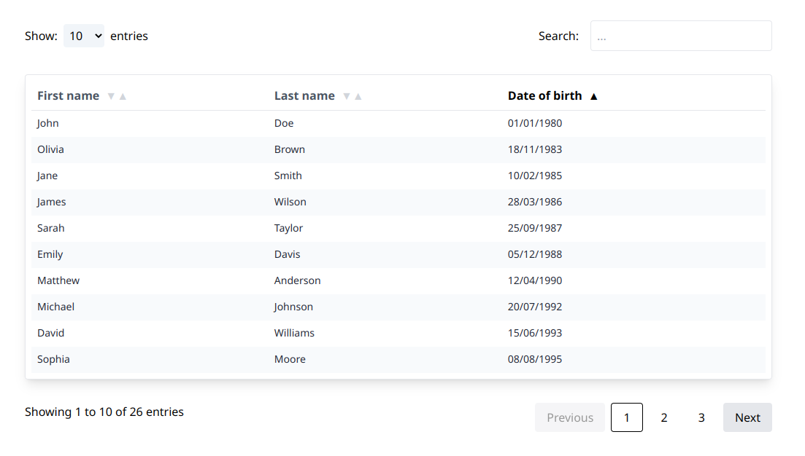

# ja-react-table

This project is the n°14 of the [OpenClassrooms Front-End learning path](https://openclassrooms.com/fr/paths/516-developpeur-dapplication-javascript-react).

## ✨ Interface



## 🚀 Usage as a npm package

1 - install the package

```sh
pnpm install ja-react-table
```

2 - use it in your React project.

```tsx
import { Table } from 'ja-react-table';

// Some data
export const headers = [
  { name: 'firstName', label: 'First name' },
  { name: 'dateOfBirth', label: 'Date of birth' },
];

export type UserType = {
  firstName: string;
  dateOfBirth: Date;
};

export const users = [
  {
    firstName: 'John',
    dateOfBirth: new Date('1980-01-01'),
  },
  {
    firstName: 'Alice',
    dateOfBirth: new Date('1985-02-10'),
  },
  {
    firstName: 'Peter',
    dateOfBirth: new Date('1977-01-24'),
  },
];

const App = () => {
  return (
    <main>
      <Table<UserType> headers={headers} items={users} />
    </main>
  );
};

export default App;
```

## 🛠️ Installation

To get and build the project you will need to install:

- [NodeJS](https://nodejs.org/)
- [Git](https://git-scm.com/)
- Optional : PNPM instead of NPM

Copy the project and install dependencies:

```sh
git clone https://github.com/jeromeabel/ja-react-table.git
cd ja-react-table
pnpm install
```

## Tests

**Manual tests in the browser**

```sh
npm run dev
```

And open the browser at this address : http://localhost:5173/

**With integration tests**

```sh
npm run test
```

## 👤 Author

[@jeromeabel](https://github.com/jeromeabel)

## 📝 License

[GNU--GPL--3](https://www.gnu.org/licenses/gpl-3.0.fr.html)
