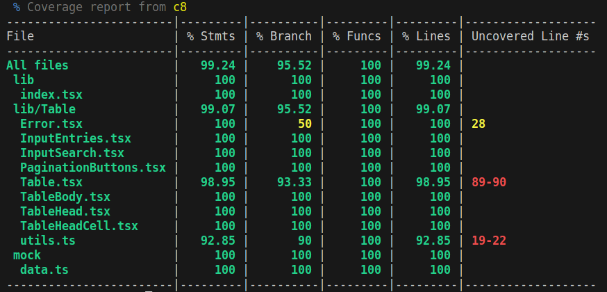

# ja-react-table

This project is the n°14 of the [OpenClassrooms Front-End learning path](https://openclassrooms.com/fr/paths/516-developpeur-dapplication-javascript-react).

The goal is to create a React component and publish it as a NPM package.

I've chose to build a React Table component written in TypeScript. It displays tabular data with sorting, searching, pagination, and error handling functionalities.

```tsx
// Basic usage
<Table<ItemType> headers={headers} items={items} sortBy="dateOfBirth" />
```

## ✨ Interface


## 🚀 Usage as a npm package

1 - install the package

```sh
pnpm install ja-react-table
```

2 - use it in your React project.

```tsx
// Import the component
import { Table } from 'ja-react-table';

// Import CSS (tailwind)
import '../node_modules/ja-react-table/dist/style.css';

// Some data
const headers = [
  { name: 'firstName', label: 'First name' },
  { name: 'dateOfBirth', label: 'Date of birth' },
];

type UserType = {
  firstName: string;
  dateOfBirth: Date;
};

const users = [
  {
    firstName: 'John',
    dateOfBirth: new Date('1980-01-01'),
  },
  {
    firstName: 'Alice',
    dateOfBirth: new Date('1985-02-10'),
  },
  {
    firstName: 'Peter',
    dateOfBirth: new Date('1977-01-24'),
  },
  {
    firstName: 'Sarah',
    dateOfBirth: new Date('1992-08-15'),
  },
  {
    firstName: 'Michael',
    dateOfBirth: new Date('1988-06-05'),
  },
];

function App() {
  return (
    <div className="container mx-auto">
      <Table<UserType> headers={headers} items={users} />
    </div>
  );
}

export default App;
```

## 🛠️ Installation

To get and build the project you will need to install:

- [NodeJS](https://nodejs.org/)
- [Git](https://git-scm.com/)
- Optional : PNPM instead of NPM

Copy the project and install dependencies:

```sh
git clone https://github.com/jeromeabel/ja-react-table.git
cd ja-react-table
pnpm install
```

## Tests



**Manual tests in the browser** and open the browser at this address : http://localhost:5173/

```sh
npm run dev
```

**With integration tests**

```sh
npm run test
npm run coverage
```

## 👤 Author

[@jeromeabel](https://github.com/jeromeabel)

## 📝 License

[GNU--GPL--3](https://www.gnu.org/licenses/gpl-3.0.fr.html)
